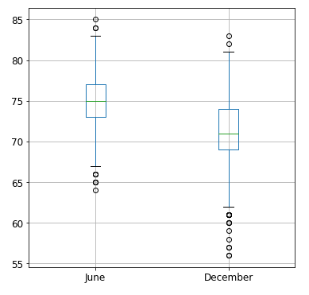

# Analysis of weather patterns to predict business viability
## Project description
Project goal is to aid a business plan for a potential ice cream and surf shop in Oahu, Hawaii.  The analysis is intended to identify potential temperature issues during the year that may make a year-round shop of this nature infeasible.

## Resources
* Jupyter Lab (3.2.1)
* Python (3.7.11)
* Pandas (1.3.4)
* Visual Studio Code (1.63.2)
* sqlAlchemy (1.4.31)

## The Data
Data is extracted from National Weather Service data using a sqlite database, using nine unique weather stations across the island of Oahu, with multiple years of readings.  Data was subsequently imported via sqlAlchemy and analyzed using Pandas.

## Analysis
### Conclusions
* Mean temperature only shows a five-degree difference between June and December, with temperatures remaining 71 degrees on average in December.
* High temperatures only differ by two degrees (85 in June vs 83 in December).
* Standard deviation is 15% higher in December, suggesting the prevalence of both warm and cool temperatures.
* Lower mean temperature in December is largely driven by outliers in data set, per Fig. 2 below.

Current analysis supports feasibility of a year-round shop reliant on warm weather.  December will contain a higher count of cool-weather days, but not so dramatically as to render the business inoperable in that month.

### Further analysis
Further queries that could elaborate on the analysis include:

* *Precipitation* - Conduct statistical analysis regarding precipitation.  How many days with rain does each month receive?  What is the average rainfall per rainy day?
* *Analysis of reading count discrepancy* - As seen below in Fig. 1, December contained nearly 11% fewer total reading counts than June.  Cause is currently unknown, and analysis of data set could identify possible issues in data that skew the value of the current data set.

### Supporting figures
*Fig. 1: Statistical breakdown of June vs december, with difference sfor each key metric*
|         |June|Dec|Absolute difference|% Difference|
|---------|---------|--------|--------|--------|
count|	1700|	1517|	183|	10.764706|
mean|	74.944118|	71.041529|	3.902588|	5.207331|
std|	3.257417|	3.745920|	-0.488503|	-14.996630|
min|	64|	56|	8|	12.5|
25%|	73|	69|	4|	5.479452|
50%|	75|	71|	4|	5.333333|
75%|	77|	74|	3|	3.896104|
max|	85|	83|	2|	2.352941|

*Fig. 2: Comparative box plot of monthly temperature readings*

